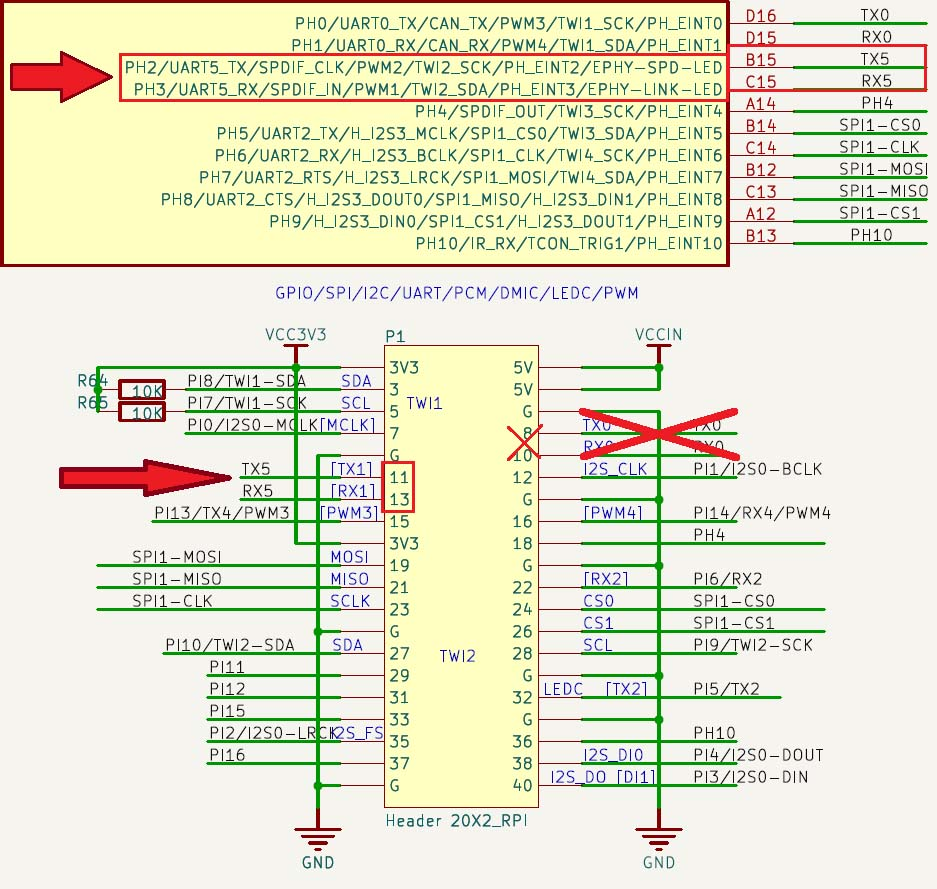
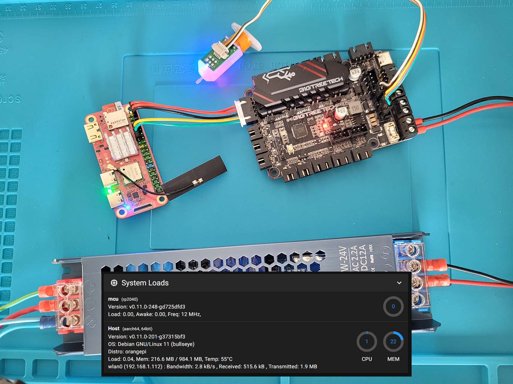

# Instructions to connect MangoPi MQ-Quad (Allwinner H616) to Klipper serial UART
Edit `orangepiEnv.txt` and add `overlays=uart5`:
```
sudo nano /boot/orangepiEnv.txt
```
## 
In Klipper `printer.cfg`:
``` 
[mcu]
serial: /dev/ttyS5
restart_method: command
```
## 
Connect printer board RX-TX to MangoPi TX-RX accordingly:


##
Enjoy.

